# 📘 Diagramas del Sistema BioVital

Documento consolidado con **todos los diagramas** del sistema BioVital, expresados en Mermaid. Las fuentes son: `index.php` (front controller), `config/routes.php` (54 rutas), los controladores en `controlador/`, los modelos en `modelo/` y las vistas en `vista/`.

> Convenciones de color:
> - 🟢 **verde** → operativo
> - 🟡 **amarillo** → parcial / advertencia
> - 🔴 **rojo** → roto / faltante / crítico

---

## Índice

1. [Arquitectura General (capas)](#1-arquitectura-general-capas)
2. [Modelo C4 — Contexto](#2-modelo-c4--contexto)
3. [Modelo C4 — Contenedores](#3-modelo-c4--contenedores)
4. [Mapa de Módulos Funcionales](#4-mapa-de-módulos-funcionales)
5. [Modelo Entidad-Relación (BD)](#5-modelo-entidad-relación-bd)
6. [Jerarquía Geográfica](#6-jerarquía-geográfica)
7. [Diagrama de Clases — Controladores](#7-diagrama-de-clases--controladores)
8. [Diagrama de Clases — Modelos](#8-diagrama-de-clases--modelos)
9. [Diagrama de Casos de Uso por Actor](#9-diagrama-de-casos-de-uso-por-actor)
10. [Ciclo de Vida del Request (Front Controller)](#10-ciclo-de-vida-del-request-front-controller)
11. [Flujo de Autenticación](#11-flujo-de-autenticación)
12. [Flujo de Registro de Usuario](#12-flujo-de-registro-de-usuario)
13. [Flujo CSRF](#13-flujo-csrf)
14. [Flujo del Módulo de Recetas (ROTO)](#14-flujo-del-módulo-de-recetas-roto)
15. [Diagrama de Estados — Receta](#15-diagrama-de-estados--receta)
16. [Flujo de Gestión de Consultorios](#16-flujo-de-gestión-de-consultorios)
17. [Matriz de Permisos Rol × Módulo](#17-matriz-de-permisos-rol--módulo)
18. [Mapa Completo de Rutas](#18-mapa-completo-de-rutas)
19. [Estado de Implementación (Calificación)](#19-estado-de-implementación-calificación)
20. [Distribución de Módulos (Pie)](#20-distribución-de-módulos-pie)
21. [Distribución de Rutas (Pie)](#21-distribución-de-rutas-pie)
22. [Plan de Remediación (Gantt)](#22-plan-de-remediación-gantt)
23. [Roadmap por Sprints](#23-roadmap-por-sprints)
24. [Estructura de Carpetas](#24-estructura-de-carpetas)
25. [Mapa Mental del Sistema](#25-mapa-mental-del-sistema)
26. [Dependencias Controlador → Modelo → Tabla](#26-dependencias-controlador--modelo--tabla)

---

## 1. Arquitectura General (capas)

Vista de alto nivel: capas, componentes principales y dependencias.

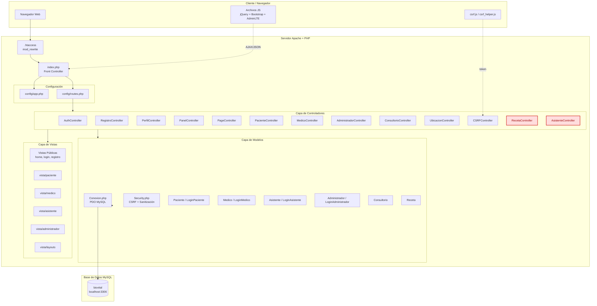
```mermaid
graph TB
    subgraph Cliente["Cliente / Navegador"]
        Browser[Navegador Web]
        JS[Archivos JS<br/>jQuery + Bootstrap + AdminLTE]
        CSRF_JS[csrf.js / csrf_helper.js]
    end

    subgraph Servidor["Servidor Apache + PHP"]
        HT[.htaccess<br/>mod_rewrite]
        IDX[index.php<br/>Front Controller]

        subgraph Config["Configuración"]
            APP[config/app.php]
            ROUTES[config/routes.php]
        end

        subgraph Controladores["Capa de Controladores"]
            AUTH[AuthController]
            REG[RegistroController]
            PERF[PerfilController]
            PAN[PanelController]
            PAG[PageController]
            PAC_C[PacienteController]
            MED_C[MedicoController]
            ADM_C[AdministradorController]
            CON_C[ConsultorioController]
            UBI_C[UbicacionController]
            CSRF_C[CSRFController]
            REC_C[RecetaController]:::missing
            ASI_C[AsistenteController]:::missing
        end

        subgraph Modelos["Capa de Modelos"]
            CONX[Conexion.php<br/>PDO MySQL]
            SEC[Security.php<br/>CSRF + Sanitización]
            PAC_M[Paciente / LoginPaciente]
            MED_M[Medico / LoginMedico]
            ASI_M[Asistente / LoginAsistente]
            ADM_M[Administrador / LoginAdministrador]
            CONSU[Consultorio]
            REC_M[Receta]
        end

        subgraph Vistas["Capa de Vistas"]
            V_PUB[Vistas Públicas<br/>home, login, registro]
            V_PAC[vista/paciente]
            V_MED[vista/medico]
            V_ASI[vista/asistente]
            V_ADM[vista/administrador]
            V_LAY[vista/layouts]
        end
    end

    subgraph BD["Base de Datos MySQL"]
        DB[(biovital<br/>localhost:3306)]
    end

    Browser --> HT
    HT --> IDX
    IDX --> APP
    IDX --> ROUTES
    ROUTES --> Controladores
    Controladores --> Modelos
    Controladores --> Vistas
    Modelos --> CONX
    CONX --> DB
    JS -.AJAX/JSON.-> IDX
    CSRF_JS -.token.-> CSRF_C

    classDef missing fill:#ffdddd,stroke:#cc0000,stroke-width:2px,color:#900
```

---

## 2. Modelo C4 — Contexto

Sistema BioVital ubicado entre sus actores y dependencias externas.

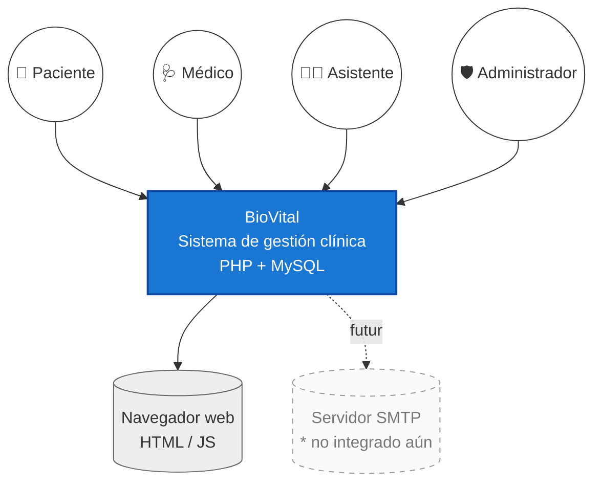
```mermaid
graph TB
    P((👤 Paciente)):::actor
    M((🩺 Médico)):::actor
    A((👩‍⚕️ Asistente)):::actor
    AD((🛡️ Administrador)):::actor

    SYS[BioVital<br/>Sistema de gestión clínica<br/>PHP + MySQL]:::system

    BROWSER[(Navegador web<br/>HTML / JS)]:::ext
    SMTP[(Servidor SMTP<br/>* no integrado aún)]:::extOff

    P --> SYS
    M --> SYS
    A --> SYS
    AD --> SYS
    SYS --> BROWSER
    SYS -.futuro.-> SMTP

    classDef system fill:#1976d2,stroke:#0d47a1,color:#fff,stroke-width:2px
    classDef actor fill:#fff,stroke:#333,color:#333
    classDef ext fill:#eeeeee,stroke:#666,color:#333
    classDef extOff stroke-dasharray: 5 5,fill:#fafafa,stroke:#999,color:#777
```

---

## 3. Modelo C4 — Contenedores

Contenedores lógicos que componen el sistema.

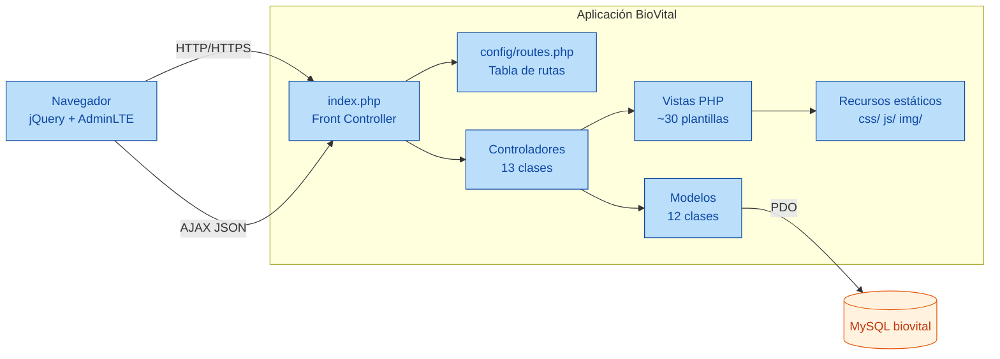
```mermaid
graph LR
    Browser[Navegador<br/>jQuery + AdminLTE]:::c

    subgraph App["Aplicación BioVital"]
        FC[index.php<br/>Front Controller]:::c
        Router[config/routes.php<br/>Tabla de rutas]:::c
        Ctrls[Controladores<br/>13 clases]:::c
        Models[Modelos<br/>12 clases]:::c
        Views[Vistas PHP<br/>~30 plantillas]:::c
        Static[Recursos estáticos<br/>css/ js/ img/]:::c
    end

    DB[(MySQL biovital)]:::db

    Browser -->|HTTP/HTTPS| FC
    Browser -->|AJAX JSON| FC
    FC --> Router
    FC --> Ctrls
    Ctrls --> Models
    Ctrls --> Views
    Views --> Static
    Models -->|PDO| DB

    classDef c fill:#bbdefb,stroke:#0d47a1,color:#0d47a1
    classDef db fill:#fff3e0,stroke:#e65100,color:#bf360c
```

---

## 4. Mapa de Módulos Funcionales

Distribución de los 11 módulos del sistema, su estado y los roles que los consumen.

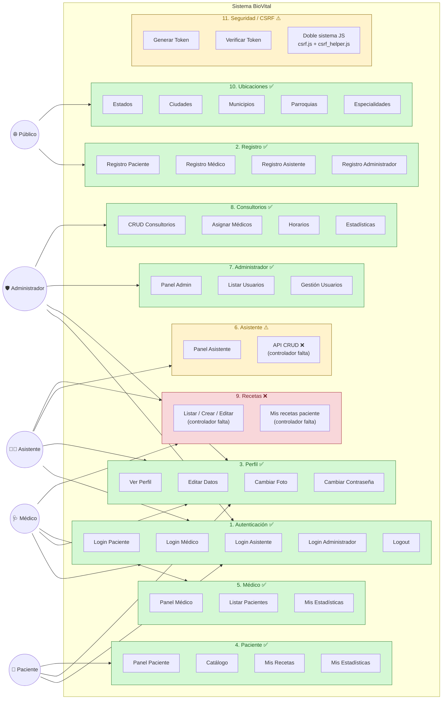
```mermaid
graph LR
    subgraph Sistema["Sistema BioVital"]

        subgraph M1["1. Autenticación ✅"]
            M1A[Login Paciente]
            M1B[Login Médico]
            M1C[Login Asistente]
            M1D[Login Administrador]
            M1E[Logout]
        end

        subgraph M2["2. Registro ✅"]
            M2A[Registro Paciente]
            M2B[Registro Médico]
            M2C[Registro Asistente]
            M2D[Registro Administrador]
        end

        subgraph M3["3. Perfil ✅"]
            M3A[Ver Perfil]
            M3B[Editar Datos]
            M3C[Cambiar Foto]
            M3D[Cambiar Contraseña]
        end

        subgraph M4["4. Paciente ✅"]
            M4A[Panel Paciente]
            M4B[Catálogo]
            M4C[Mis Recetas]
            M4D[Mis Estadísticas]
        end

        subgraph M5["5. Médico ✅"]
            M5A[Panel Médico]
            M5B[Listar Pacientes]
            M5C[Mis Estadísticas]
        end

        subgraph M6["6. Asistente ⚠️"]
            M6A[Panel Asistente]
            M6B["API CRUD ❌<br/>(controlador falta)"]
        end

        subgraph M7["7. Administrador ✅"]
            M7A[Panel Admin]
            M7B[Listar Usuarios]
            M7C[Gestión Usuarios]
        end

        subgraph M8["8. Consultorios ✅"]
            M8A[CRUD Consultorios]
            M8B[Asignar Médicos]
            M8C[Horarios]
            M8D[Estadísticas]
        end

        subgraph M9["9. Recetas ❌"]
            M9A["Listar / Crear / Editar<br/>(controlador falta)"]
            M9B["Mis recetas paciente<br/>(controlador falta)"]
        end

        subgraph M10["10. Ubicaciones ✅"]
            M10A[Estados]
            M10B[Ciudades]
            M10C[Municipios]
            M10D[Parroquias]
            M10E[Especialidades]
        end

        subgraph M11["11. Seguridad / CSRF ⚠️"]
            M11A[Generar Token]
            M11B[Verificar Token]
            M11C["Doble sistema JS<br/>csrf.js + csrf_helper.js"]
        end
    end

    PAC((👤 Paciente)) --> M1
    PAC --> M3
    PAC --> M4
    MED((🩺 Médico)) --> M1
    MED --> M3
    MED --> M5
    MED --> M9
    ASI((👩‍⚕️ Asistente)) --> M1
    ASI --> M3
    ASI --> M6
    ASI --> M9
    ADM((🛡️ Administrador)) --> M1
    ADM --> M3
    ADM --> M7
    ADM --> M8
    PUB((🌐 Público)) --> M2
    PUB --> M10

    classDef ok fill:#d4f8d4,stroke:#2e7d32,color:#1b5e20
    classDef warn fill:#fff3cd,stroke:#856404,color:#856404
    classDef bad fill:#f8d7da,stroke:#a02633,color:#721c24

    class M1,M2,M3,M4,M5,M7,M8,M10 ok
    class M6,M11 warn
    class M9 bad
```

---

## 5. Modelo Entidad-Relación (BD)

Esquema entidad-relación inferido de los modelos. Base de datos `biovital` en MySQL.

```mermaid
erDiagram
    TIPO_PACIENTE ||--o{ REGISTRO_PACIENTE : "clasifica"
    TIPO_PACIENTE ||--o{ REGISTRO_MEDICO : "clasifica"
    TIPO_PACIENTE ||--o{ REGISTRO_ASISTENTE : "clasifica"
    TIPO_PACIENTE ||--o{ REGISTRO_ADMINISTRADOR : "clasifica"

    REGISTRO_PACIENTE ||--|| LOGIN_PACIENTE : "tiene credencial"
    REGISTRO_MEDICO ||--|| LOGIN_MEDICO : "tiene credencial"
    REGISTRO_ASISTENTE ||--|| LOGIN_ASISTENTE : "tiene credencial"
    REGISTRO_ADMINISTRADOR ||--|| LOGIN_ADMINISTRADOR : "tiene credencial"

    REGISTRO_PACIENTE ||--o{ RECETAS : "recibe"
    REGISTRO_MEDICO ||--o{ RECETAS : "emite"

    CONSULTORIOS ||--o{ CONSULTORIO_MEDICOS : "agrupa"
    REGISTRO_MEDICO ||--o{ CONSULTORIO_MEDICOS : "trabaja en"

    ESTADOS ||--o{ CIUDADES : "contiene"
    CIUDADES ||--o{ MUNICIPIOS : "contiene"
    MUNICIPIOS ||--o{ PARROQUIAS : "contiene"

    ESTADOS ||--o{ CONSULTORIOS : "ubicado en"
    CIUDADES ||--o{ CONSULTORIOS : "ubicado en"
    MUNICIPIOS ||--o{ CONSULTORIOS : "ubicado en"
    PARROQUIAS ||--o{ CONSULTORIOS : "ubicado en"

    ESPECIALIDADES ||--o{ REGISTRO_MEDICO : "ejerce"

    TIPO_PACIENTE {
        int id_tipo_us PK
        string nombre_tipo "Paciente|Medico|Asistente|Administrador"
    }
    REGISTRO_PACIENTE {
        int id_paciente PK
        string cedula_paciente UK
        string nombre_paciente
        string apellido_paciente
        date fecha_nacimiento_pac
        string telefono_paciente
        string direccion_paciente
        string correo_paciente
        char sexo_paciente
        text adicional_paciente
        string avatar_paciente
        int paciente_tipo FK
    }
    REGISTRO_MEDICO {
        int id_medico PK
        string cedula_medico UK
        string nombre_medico
        string apellido_medico
        date fecha_nacimiento_medico
        string telefono_medico
        string direccion_medico
        string correo_medico
        char sexo_medico
        text adicional_medico
        string avatar_medico
        int medico_tipo FK
    }
    REGISTRO_ASISTENTE {
        int id_asistente PK
        string cedula_asistente UK
        string nombre_asistente
        string apellido_asistente
        string telefono_asistente
        string correo_asistente
        string avatar_asistente
        int asistente_tipo FK
    }
    REGISTRO_ADMINISTRADOR {
        int id_administrador PK
        string cedula_administrador UK
        string nombre_administrador
        string apellido_administrador
        string telefono_administrador
        string correo_administrador
        string avatar_administrador
        int administrador_tipo FK
    }
    LOGIN_PACIENTE {
        int id_paciente PK_FK
        string password_hash "bcrypt"
        string status
        datetime ultimo_acceso
    }
    LOGIN_MEDICO {
        int id_medico PK_FK
        string password_hash "bcrypt"
        string status
        datetime ultimo_acceso
    }
    LOGIN_ASISTENTE {
        int id_asistente PK_FK
        string password_hash "bcrypt"
        string status
        datetime ultimo_acceso
    }
    LOGIN_ADMINISTRADOR {
        int id_administrador PK_FK
        string password_hash "bcrypt"
        string status
        datetime ultimo_acceso
    }
    CONSULTORIOS {
        int id_consultorio PK
        string nombre
        text descripcion
        time apertura_habitual
        time cierre_habitual
        string telefono
        string email
        int id_estado FK
        int id_ciudad FK
        int id_municipio FK
        int id_parroquia FK
        string direccion_detallada
        boolean activo
    }
    CONSULTORIO_MEDICOS {
        int id_consultorio PK_FK
        int id_medico PK_FK
        boolean activo
    }
    RECETAS {
        int id_receta PK
        int id_paciente FK
        int id_medico FK
        string nombre_medicamento
        string marca
        string cantidad
        string dosis
        text instrucciones
        datetime fecha_receta
        string estado
    }
    ESTADOS {
        int id_estado PK
        string nombre
    }
    CIUDADES {
        int id_ciudad PK
        int id_estado FK
        string nombre
    }
    MUNICIPIOS {
        int id_municipio PK
        int id_ciudad FK
        string nombre
    }
    PARROQUIAS {
        int id_parroquia PK
        int id_municipio FK
        string nombre
    }
    ESPECIALIDADES {
        int id_especialidad PK
        string nombre
    }
```

---

## 6. Jerarquía Geográfica

Cómo se anida la división territorial usada en consultorios y registros.

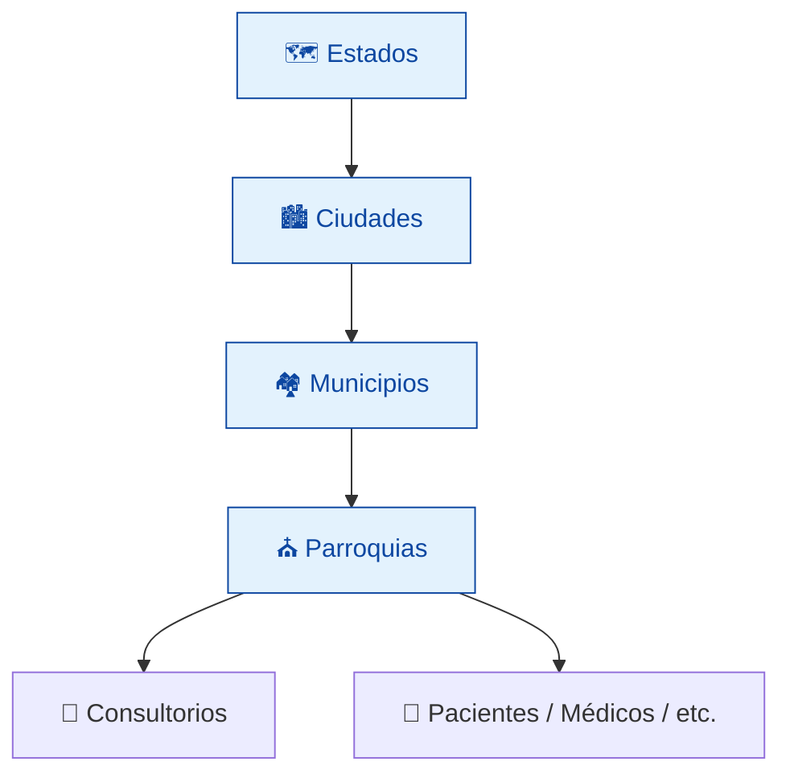
```mermaid
graph TD
    E[🗺️ Estados] --> C[🏙️ Ciudades]
    C --> M[🏘️ Municipios]
    M --> P[⛪ Parroquias]
    P --> CON[🏥 Consultorios]
    P --> PAC[👤 Pacientes / Médicos / etc.]

    classDef geo fill:#e3f2fd,stroke:#0d47a1,color:#0d47a1
    class E,C,M,P geo
```

---

## 7. Diagrama de Clases — Controladores

Relaciones entre los controladores y los modelos que orquestan.

```mermaid
classDiagram
    class AuthController {
        +showLoginPaciente()
        +showLoginMedico()
        +showLoginAsistente()
        +showLoginAdministrador()
        +login()
        +logout()
    }
    class RegistroController {
        +showRegistroPaciente()
        +showRegistroMedico()
        +showRegistroAsistente()
        +showRegistroAdministrador()
        +crearPaciente()
        +crearMedico()
        +crearAsistente()
        +crearAdministrador()
    }
    class PerfilController {
        +index()
        +editar()
        +cambiarFoto()
        +cambiarPassword()
        +getDatos()
    }
    class PanelController {
        +paciente()
        +medico()
        +asistente()
        +administrador()
    }
    class PageController {
        +home()
    }
    class PacienteController {
        +recetas()
        +buscar()
        +capturarDatos()
        +editarUsuario()
        +cambiarFoto()
        +cambiarPassword()
        +misEstadisticas()
    }
    class MedicoController {
        +pacientes()
        +buscar()
        +capturarDatos()
        +editarUsuario()
        +cambiarFoto()
        +cambiarPassword()
        +misEstadisticas()
        +listarPacientes()
    }
    class AdministradorController {
        +buscar()
        +capturarDatos()
        +editarUsuario()
        +cambiarFoto()
        +cambiarPassword()
        +listarUsuarios()
    }
    class ConsultorioController {
        +index()
        +crear()
        +editar()
        +detalle()
        +horarios()
        +listar()
        +crearConsultorio()
        +editarConsultorio()
        +eliminarConsultorio()
        +asignarMedico()
        +removerMedico()
        +guardarHorario()
        +obtenerDetalle()
        +obtenerHorarios()
        +obtenerEstadisticas()
        +listarMedicosDisponibles()
    }
    class UbicacionController {
        +listarEstados()
        +listarCiudades()
        +listarMunicipios()
        +listarParroquias()
        +listaEspecialidades()
    }
    class CSRFController {
        +getToken()
    }
    class RecetaController {
        <<FALTANTE>>
        +index()
        +listar()
        +crear()
        +editar()
        +borrar()
        +obtener()
        +buscarPacientes()
        +misRecetas()
    }
    class AsistenteController {
        <<FALTANTE>>
        +buscar()
        +capturarDatos()
        +editarUsuario()
        +cambiarFoto()
        +cambiarPassword()
    }

    AuthController --> LoginPaciente
    AuthController --> LoginMedico
    AuthController --> LoginAsistente
    AuthController --> LoginAdministrador
    RegistroController --> Paciente
    RegistroController --> Medico
    RegistroController --> Asistente
    RegistroController --> Administrador
    PerfilController --> Paciente
    PerfilController --> Medico
    PerfilController --> Asistente
    PerfilController --> Administrador
    PacienteController --> Paciente
    MedicoController --> Medico
    AdministradorController --> Administrador
    ConsultorioController --> Consultorio
    UbicacionController --> Conexion
    CSRFController --> Security
    RecetaController ..> Receta
    AsistenteController ..> Asistente
```

---

## 8. Diagrama de Clases — Modelos

Estructura del dominio: modelos de datos y sus relaciones.

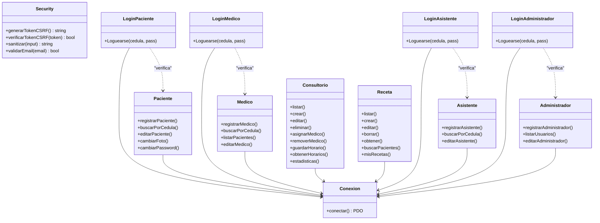
```mermaid
classDiagram
    class Conexion {
        +conectar() PDO
    }
    class Security {
        +generarTokenCSRF() string
        +verificarTokenCSRF(token) bool
        +sanitizar(input) string
        +validarEmail(email) bool
    }

    class Paciente {
        +registrarPaciente()
        +buscarPorCedula()
        +editarPaciente()
        +cambiarFoto()
        +cambiarPassword()
    }
    class Medico {
        +registrarMedico()
        +buscarPorCedula()
        +listarPacientes()
        +editarMedico()
    }
    class Asistente {
        +registrarAsistente()
        +buscarPorCedula()
        +editarAsistente()
    }
    class Administrador {
        +registrarAdministrador()
        +listarUsuarios()
        +editarAdministrador()
    }

    class LoginPaciente {
        +Loguearse(cedula, pass)
    }
    class LoginMedico {
        +Loguearse(cedula, pass)
    }
    class LoginAsistente {
        +Loguearse(cedula, pass)
    }
    class LoginAdministrador {
        +Loguearse(cedula, pass)
    }

    class Consultorio {
        +listar()
        +crear()
        +editar()
        +eliminar()
        +asignarMedico()
        +removerMedico()
        +guardarHorario()
        +obtenerHorarios()
        +estadisticas()
    }
    class Receta {
        +listar()
        +crear()
        +editar()
        +borrar()
        +obtener()
        +buscarPacientes()
        +misRecetas()
    }

    Paciente --> Conexion
    Medico --> Conexion
    Asistente --> Conexion
    Administrador --> Conexion
    LoginPaciente --> Conexion
    LoginMedico --> Conexion
    LoginAsistente --> Conexion
    LoginAdministrador --> Conexion
    Consultorio --> Conexion
    Receta --> Conexion

    LoginPaciente ..> Paciente : "verifica"
    LoginMedico ..> Medico : "verifica"
    LoginAsistente ..> Asistente : "verifica"
    LoginAdministrador ..> Administrador : "verifica"
```

---

## 9. Diagrama de Casos de Uso por Actor

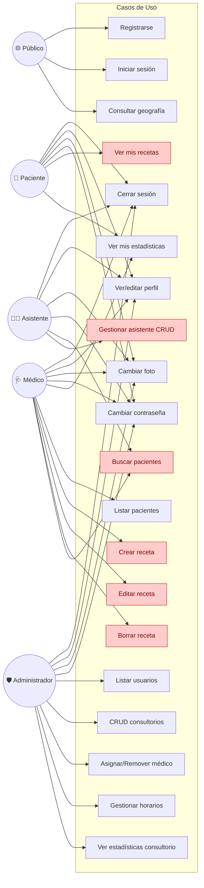
```mermaid
graph LR
    PAC((👤 Paciente))
    MED((🩺 Médico))
    ASI((👩‍⚕️ Asistente))
    ADM((🛡️ Administrador))
    PUB((🌐 Público))

    subgraph CU["Casos de Uso"]
        U1[Registrarse]
        U2[Iniciar sesión]
        U3[Cerrar sesión]
        U4[Ver/editar perfil]
        U5[Cambiar foto]
        U6[Cambiar contraseña]
        U7[Ver mis recetas]:::bad
        U8[Ver mis estadísticas]
        U9[Listar pacientes]
        U10[Crear receta]:::bad
        U11[Editar receta]:::bad
        U12[Borrar receta]:::bad
        U13[Buscar pacientes]:::bad
        U14[Gestionar asistente CRUD]:::bad
        U15[Listar usuarios]
        U16[CRUD consultorios]
        U17[Asignar/Remover médico]
        U18[Gestionar horarios]
        U19[Ver estadísticas consultorio]
        U20[Consultar geografía]
    end

    PUB --> U1
    PUB --> U2
    PUB --> U20

    PAC --> U3
    PAC --> U4
    PAC --> U5
    PAC --> U6
    PAC --> U7
    PAC --> U8

    MED --> U3
    MED --> U4
    MED --> U5
    MED --> U6
    MED --> U8
    MED --> U9
    MED --> U10
    MED --> U11
    MED --> U12
    MED --> U13

    ASI --> U3
    ASI --> U4
    ASI --> U5
    ASI --> U6
    ASI --> U13
    ASI --> U14

    ADM --> U3
    ADM --> U4
    ADM --> U5
    ADM --> U6
    ADM --> U15
    ADM --> U16
    ADM --> U17
    ADM --> U18
    ADM --> U19

    classDef bad fill:#ffcccc,stroke:#c62828,color:#7f0000
```

---

## 10. Ciclo de Vida del Request (Front Controller)

Cómo `index.php` resuelve cualquier petición HTTP entrante.

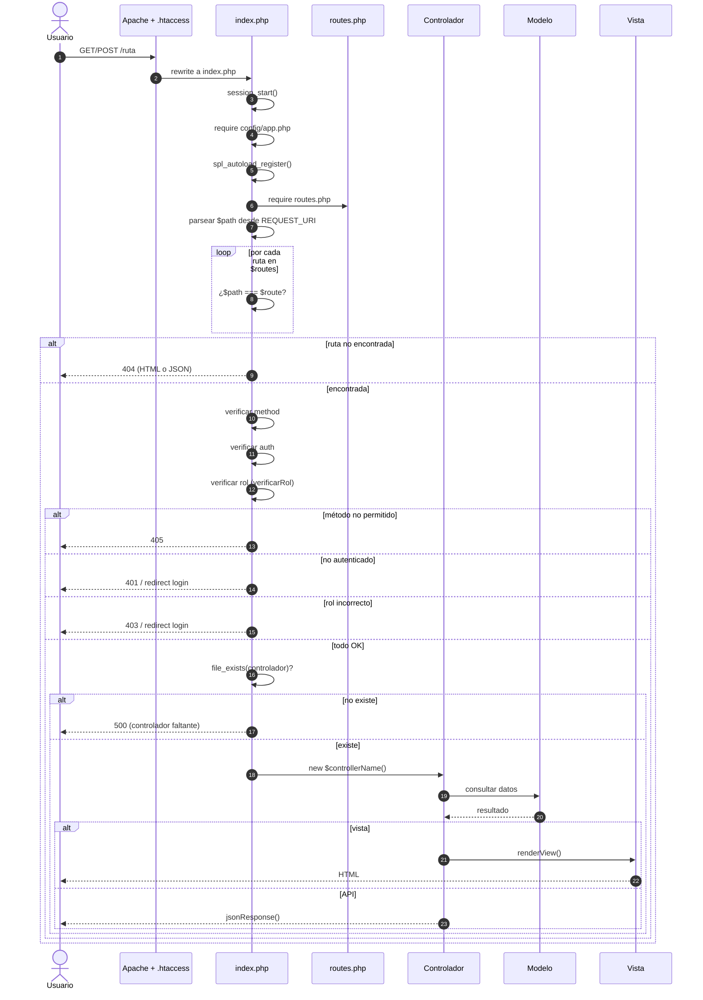
```mermaid
sequenceDiagram
    autonumber
    actor U as Usuario
    participant H as Apache + .htaccess
    participant I as index.php
    participant R as routes.php
    participant C as Controlador
    participant M as Modelo
    participant V as Vista

    U->>H: GET/POST /ruta
    H->>I: rewrite a index.php
    I->>I: session_start()
    I->>I: require config/app.php
    I->>I: spl_autoload_register()
    I->>R: require routes.php
    I->>I: parsear $path desde REQUEST_URI

    loop por cada ruta en $routes
        I->>I: ¿$path === $route?
    end

    alt ruta no encontrada
        I-->>U: 404 (HTML o JSON)
    else encontrada
        I->>I: verificar method
        I->>I: verificar auth
        I->>I: verificar rol (verificarRol)
        alt método no permitido
            I-->>U: 405
        else no autenticado
            I-->>U: 401 / redirect login
        else rol incorrecto
            I-->>U: 403 / redirect login
        else todo OK
            I->>I: file_exists(controlador)?
            alt no existe
                I-->>U: 500 (controlador faltante)
            else existe
                I->>C: new $controllerName()
                C->>M: consultar datos
                M-->>C: resultado
                alt vista
                    C->>V: renderView()
                    V-->>U: HTML
                else API
                    C-->>U: jsonResponse()
                end
            end
        end
    end
```

---

## 11. Flujo de Autenticación

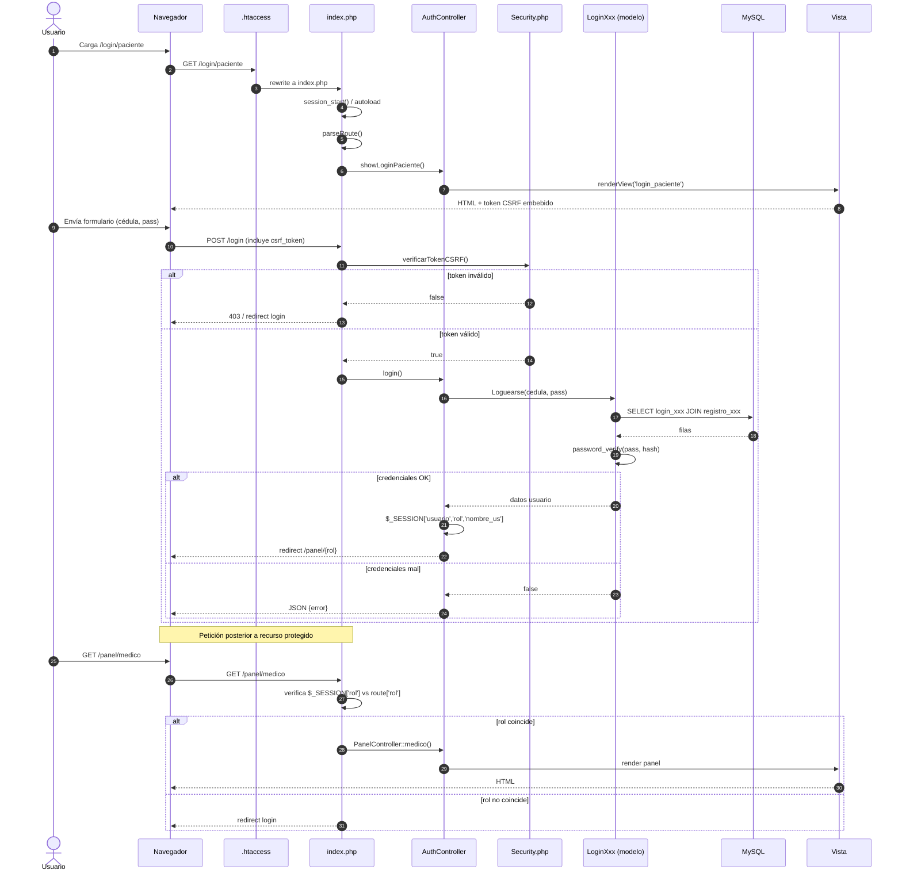
```mermaid
sequenceDiagram
    autonumber
    actor U as Usuario
    participant B as Navegador
    participant H as .htaccess
    participant I as index.php
    participant CTRL as AuthController
    participant SEC as Security.php
    participant LOG as LoginXxx (modelo)
    participant DB as MySQL
    participant V as Vista

    U->>B: Carga /login/paciente
    B->>H: GET /login/paciente
    H->>I: rewrite a index.php
    I->>I: session_start() / autoload
    I->>I: parseRoute()
    I->>CTRL: showLoginPaciente()
    CTRL->>V: renderView('login_paciente')
    V-->>B: HTML + token CSRF embebido

    U->>B: Envía formulario (cédula, pass)
    B->>I: POST /login (incluye csrf_token)
    I->>SEC: verificarTokenCSRF()
    alt token inválido
        SEC-->>I: false
        I-->>B: 403 / redirect login
    else token válido
        SEC-->>I: true
        I->>CTRL: login()
        CTRL->>LOG: Loguearse(cedula, pass)
        LOG->>DB: SELECT login_xxx JOIN registro_xxx
        DB-->>LOG: filas
        LOG->>LOG: password_verify(pass, hash)
        alt credenciales OK
            LOG-->>CTRL: datos usuario
            CTRL->>CTRL: $_SESSION['usuario','rol','nombre_us']
            CTRL-->>B: redirect /panel/{rol}
        else credenciales mal
            LOG-->>CTRL: false
            CTRL-->>B: JSON {error}
        end
    end

    Note over B,I: Petición posterior a recurso protegido
    U->>B: GET /panel/medico
    B->>I: GET /panel/medico
    I->>I: verifica $_SESSION['rol'] vs route['rol']
    alt rol coincide
        I->>CTRL: PanelController::medico()
        CTRL->>V: render panel
        V-->>B: HTML
    else rol no coincide
        I-->>B: redirect login
    end
```

---

## 12. Flujo de Registro de Usuario

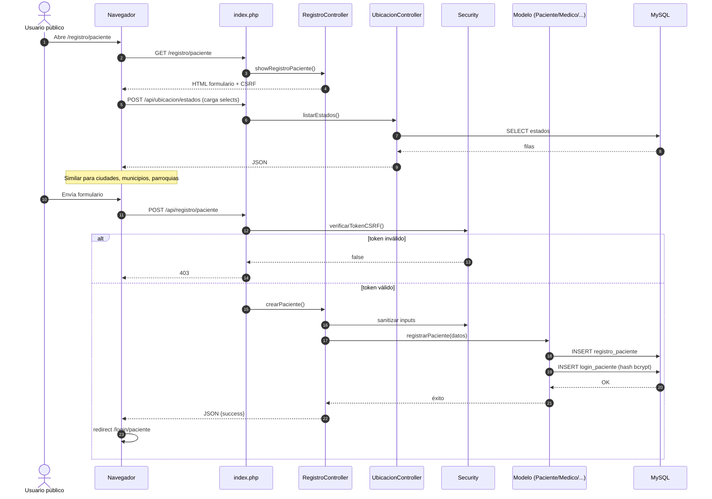
```mermaid
sequenceDiagram
    autonumber
    actor U as Usuario público
    participant B as Navegador
    participant I as index.php
    participant CTRL as RegistroController
    participant UBI as UbicacionController
    participant SEC as Security
    participant MOD as Modelo (Paciente/Medico/...)
    participant DB as MySQL

    U->>B: Abre /registro/paciente
    B->>I: GET /registro/paciente
    I->>CTRL: showRegistroPaciente()
    CTRL-->>B: HTML formulario + CSRF

    B->>I: POST /api/ubicacion/estados (carga selects)
    I->>UBI: listarEstados()
    UBI->>DB: SELECT estados
    DB-->>UBI: filas
    UBI-->>B: JSON
    Note over B: Similar para ciudades, municipios, parroquias

    U->>B: Envía formulario
    B->>I: POST /api/registro/paciente
    I->>SEC: verificarTokenCSRF()
    alt token inválido
        SEC-->>I: false
        I-->>B: 403
    else token válido
        I->>CTRL: crearPaciente()
        CTRL->>SEC: sanitizar inputs
        CTRL->>MOD: registrarPaciente(datos)
        MOD->>DB: INSERT registro_paciente
        MOD->>DB: INSERT login_paciente (hash bcrypt)
        DB-->>MOD: OK
        MOD-->>CTRL: éxito
        CTRL-->>B: JSON {success}
        B->>B: redirect /login/paciente
    end
```

---

## 13. Flujo CSRF

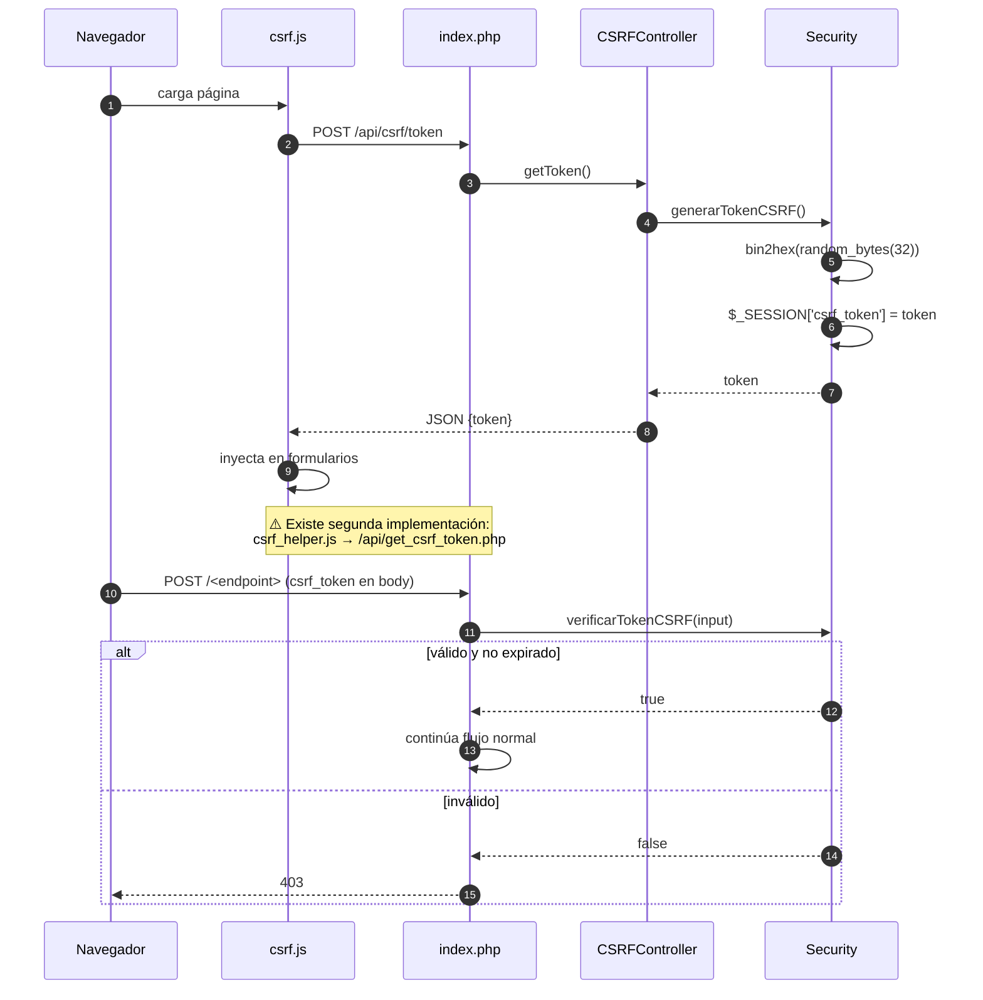
```mermaid
sequenceDiagram
    autonumber
    participant B as Navegador
    participant JS as csrf.js
    participant I as index.php
    participant CSRF as CSRFController
    participant SEC as Security

    B->>JS: carga página
    JS->>I: POST /api/csrf/token
    I->>CSRF: getToken()
    CSRF->>SEC: generarTokenCSRF()
    SEC->>SEC: bin2hex(random_bytes(32))
    SEC->>SEC: $_SESSION['csrf_token'] = token
    SEC-->>CSRF: token
    CSRF-->>JS: JSON {token}
    JS->>JS: inyecta en formularios

    Note over JS,I: ⚠️ Existe segunda implementación:<br/>csrf_helper.js → /api/get_csrf_token.php

    B->>I: POST /<endpoint> (csrf_token en body)
    I->>SEC: verificarTokenCSRF(input)
    alt válido y no expirado
        SEC-->>I: true
        I->>I: continúa flujo normal
    else inválido
        SEC-->>I: false
        I-->>B: 403
    end
```

---

## 14. Flujo del Módulo de Recetas (ROTO)

Recorrido completo de una receta, marcando los puntos rotos.

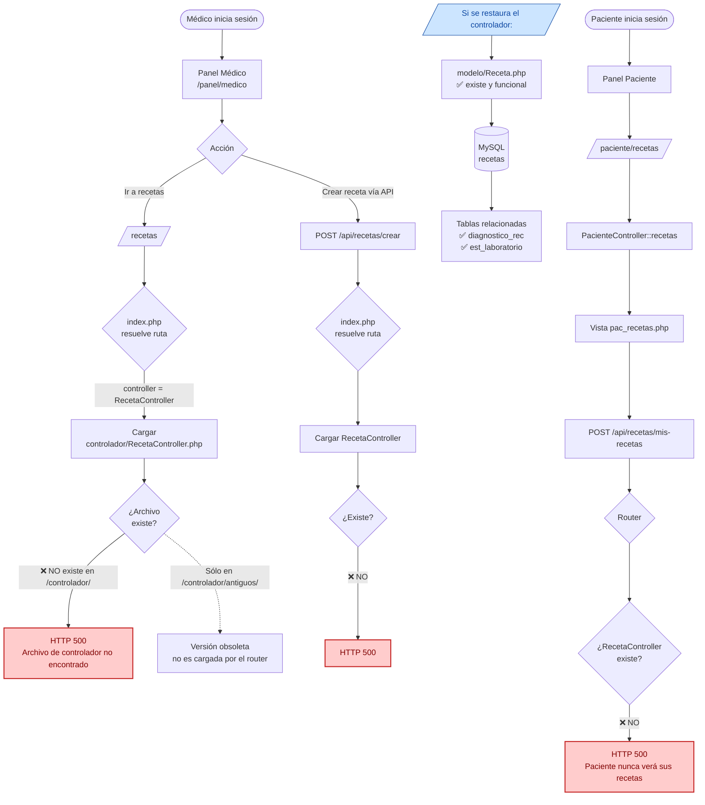
```mermaid
flowchart TD
    Start([Médico inicia sesión]) --> Panel[Panel Médico<br/>/panel/medico]
    Panel --> Menu{Acción}

    Menu -->|Ir a recetas| RouteR[/recetas/]
    RouteR --> Router{index.php<br/>resuelve ruta}
    Router -->|controller = RecetaController| LoadCtrl[Cargar<br/>controlador/RecetaController.php]

    LoadCtrl --> Check{¿Archivo<br/>existe?}
    Check -->|❌ NO existe en /controlador/| Error500[HTTP 500<br/>Archivo de controlador no encontrado]:::broken
    Check -.->|Sólo en /controlador/antiguos/| Note1[Versión obsoleta<br/>no es cargada por el router]

    Menu -->|Crear receta vía API| ApiCrear[POST /api/recetas/crear]
    ApiCrear --> Router2{index.php<br/>resuelve ruta}
    Router2 --> LoadCtrl2[Cargar RecetaController]
    LoadCtrl2 --> Check2{¿Existe?}
    Check2 -->|❌ NO| Error500b[HTTP 500]:::broken

    Note2[/Si se restaura el controlador:/]:::fix
    Note2 --> Model[modelo/Receta.php<br/>✅ existe y funcional]
    Model --> DB[(MySQL<br/>recetas)]
    DB --> Diag[Tablas relacionadas<br/>✅ diagnostico_rec<br/>✅ est_laboratorio]

    Paciente([Paciente inicia sesión]) --> PPanel[Panel Paciente]
    PPanel --> PRecetas[/paciente/recetas/]
    PRecetas --> PController[PacienteController::recetas]
    PController --> PView[Vista pac_recetas.php]
    PView --> PApi[POST /api/recetas/mis-recetas]
    PApi --> Router3{Router}
    Router3 --> CheckP{¿RecetaController<br/>existe?}
    CheckP -->|❌ NO| Error500c[HTTP 500<br/>Paciente nunca verá sus recetas]:::broken

    classDef broken fill:#ffcccc,stroke:#c62828,stroke-width:2px,color:#7f0000
    classDef fix fill:#cce5ff,stroke:#0d47a1,color:#0d47a1
```

---

## 15. Diagrama de Estados — Receta

Estados posibles de una receta (basado en campo `estado` en tabla `recetas`).

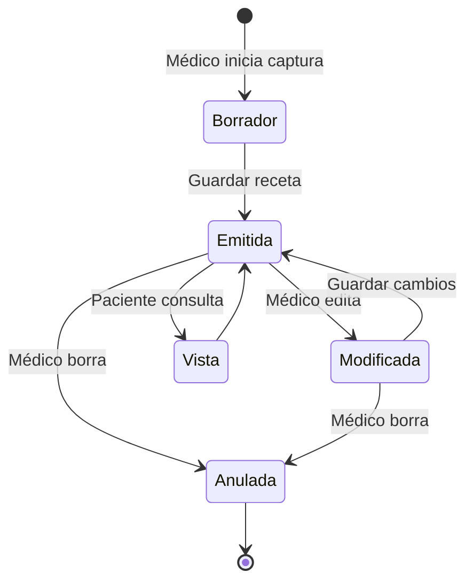
```mermaid
stateDiagram-v2
    [*] --> Borrador: Médico inicia captura
    Borrador --> Emitida: Guardar receta
    Emitida --> Modificada: Médico edita
    Modificada --> Emitida: Guardar cambios
    Emitida --> Vista: Paciente consulta
    Vista --> Emitida
    Emitida --> Anulada: Médico borra
    Modificada --> Anulada: Médico borra
    Anulada --> [*]
```

---

## 16. Flujo de Gestión de Consultorios

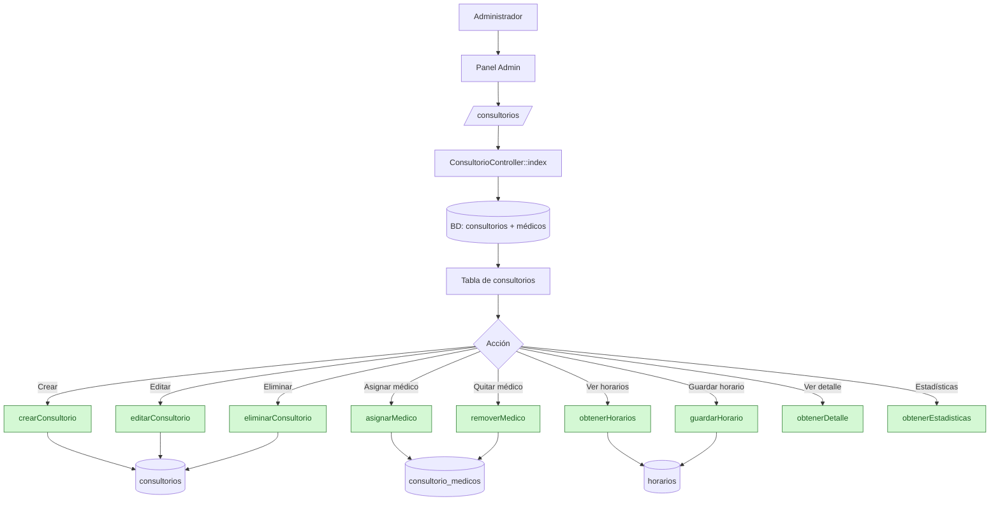
```mermaid
flowchart TD
    A[Administrador] --> P[Panel Admin]
    P --> CL[/consultorios/]
    CL --> List[ConsultorioController::index]
    List --> DB1[(BD: consultorios + médicos)]
    DB1 --> Tabla[Tabla de consultorios]

    Tabla --> Acc{Acción}
    Acc -->|Crear| Crear[crearConsultorio]
    Acc -->|Editar| Edit[editarConsultorio]
    Acc -->|Eliminar| Del[eliminarConsultorio]
    Acc -->|Asignar médico| Asig[asignarMedico]
    Acc -->|Quitar médico| Rem[removerMedico]
    Acc -->|Ver horarios| Hor[obtenerHorarios]
    Acc -->|Guardar horario| GuardH[guardarHorario]
    Acc -->|Ver detalle| Det[obtenerDetalle]
    Acc -->|Estadísticas| Stat[obtenerEstadisticas]

    Crear --> DB2[(consultorios)]
    Edit --> DB2
    Del --> DB2
    Asig --> DB3[(consultorio_medicos)]
    Rem --> DB3
    Hor --> DB4[(horarios)]
    GuardH --> DB4

    classDef ok fill:#d4f8d4,stroke:#2e7d32,color:#1b5e20
    class Crear,Edit,Del,Asig,Rem,Hor,GuardH,Det,Stat ok
```

---

## 17. Matriz de Permisos Rol × Módulo

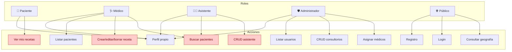
```mermaid
graph TD
    subgraph Roles
        R1[👤 Paciente]
        R2[🩺 Médico]
        R3[👩‍⚕️ Asistente]
        R4[🛡️ Administrador]
        R5[🌐 Público]
    end

    subgraph Acciones
        AC1[Registro]
        AC2[Login]
        AC3[Perfil propio]
        AC4[Listar pacientes]
        AC5[Crear/editar/borrar receta]:::bad
        AC6[Ver mis recetas]:::bad
        AC7[Buscar pacientes]:::bad
        AC8[CRUD asistente]:::bad
        AC9[Listar usuarios]
        AC10[CRUD consultorios]
        AC11[Asignar médicos]
        AC12[Consultar geografía]
    end

    R5 --> AC1
    R5 --> AC2
    R5 --> AC12

    R1 --> AC3
    R1 --> AC6

    R2 --> AC3
    R2 --> AC4
    R2 --> AC5
    R2 --> AC7

    R3 --> AC3
    R3 --> AC7
    R3 --> AC8

    R4 --> AC3
    R4 --> AC9
    R4 --> AC10
    R4 --> AC11

    classDef bad fill:#ffcccc,stroke:#c62828,color:#7f0000
```

---

## 18. Mapa Completo de Rutas

Las 54 rutas declaradas en `config/routes.php` agrupadas por familia.

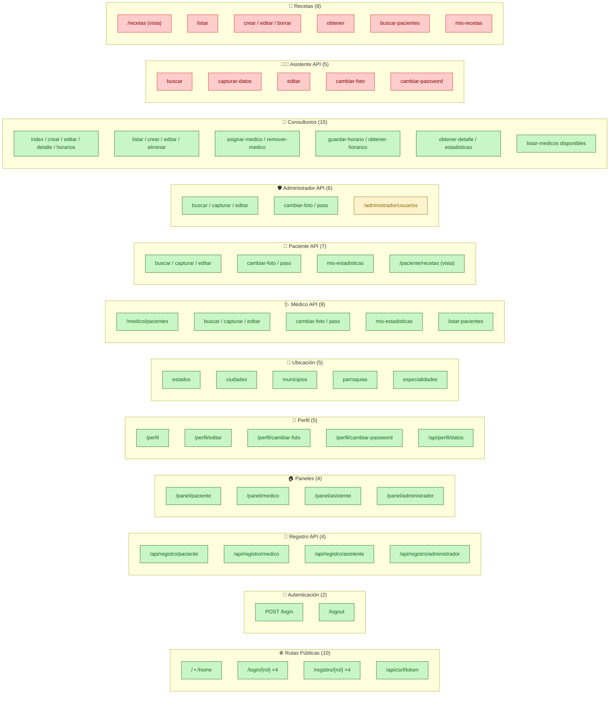
```mermaid
graph LR
    subgraph Publicas["🌐 Rutas Públicas (10)"]
        P1["/  •  /home"]:::ok
        P2["/login/{rol}  ×4"]:::ok
        P3["/registro/{rol}  ×4"]:::ok
        P4["/api/csrf/token"]:::ok
    end

    subgraph Auth["🔐 Autenticación (2)"]
        A1["POST /login"]:::ok
        A2["/logout"]:::ok
    end

    subgraph RegAPI["📝 Registro API (4)"]
        RA1["/api/registro/paciente"]:::ok
        RA2["/api/registro/medico"]:::ok
        RA3["/api/registro/asistente"]:::ok
        RA4["/api/registro/administrador"]:::ok
    end

    subgraph Paneles["🏠 Paneles (4)"]
        PA1["/panel/paciente"]:::ok
        PA2["/panel/medico"]:::ok
        PA3["/panel/asistente"]:::ok
        PA4["/panel/administrador"]:::ok
    end

    subgraph Perfil["👤 Perfil (5)"]
        PF1["/perfil"]:::ok
        PF2["/perfil/editar"]:::ok
        PF3["/perfil/cambiar-foto"]:::ok
        PF4["/perfil/cambiar-password"]:::ok
        PF5["/api/perfil/datos"]:::ok
    end

    subgraph Ubic["📍 Ubicación (5)"]
        U1["estados"]:::ok
        U2["ciudades"]:::ok
        U3["municipios"]:::ok
        U4["parroquias"]:::ok
        U5["especialidades"]:::ok
    end

    subgraph MedAPI["🩺 Médico API (8)"]
        MA1["/medico/pacientes"]:::ok
        MA2["buscar / capturar / editar"]:::ok
        MA3["cambiar-foto / pass"]:::ok
        MA4["mis-estadisticas"]:::ok
        MA5["listar-pacientes"]:::ok
    end

    subgraph PacAPI["🧑 Paciente API (7)"]
        PC1["buscar / capturar / editar"]:::ok
        PC2["cambiar-foto / pass"]:::ok
        PC3["mis-estadisticas"]:::ok
        PC4["/paciente/recetas (vista)"]:::ok
    end

    subgraph AdmAPI["🛡️ Administrador API (6)"]
        AD1["buscar / capturar / editar"]:::ok
        AD2["cambiar-foto / pass"]:::ok
        AD3["/administrador/usuarios"]:::warn
    end

    subgraph ConsAPI["🏥 Consultorios (15)"]
        C1["index / crear / editar / detalle / horarios"]:::ok
        C2["listar / crear / editar / eliminar"]:::ok
        C3["asignar-medico / remover-medico"]:::ok
        C4["guardar-horario / obtener-horarios"]:::ok
        C5["obtener-detalle / estadisticas"]:::ok
        C6["listar-medicos disponibles"]:::ok
    end

    subgraph AsiAPI["👩‍⚕️ Asistente API (5)"]
        AS1["buscar"]:::bad
        AS2["capturar-datos"]:::bad
        AS3["editar"]:::bad
        AS4["cambiar-foto"]:::bad
        AS5["cambiar-password"]:::bad
    end

    subgraph RecAPI["💊 Recetas (8)"]
        R1["/recetas (vista)"]:::bad
        R2["listar"]:::bad
        R3["crear / editar / borrar"]:::bad
        R4["obtener"]:::bad
        R5["buscar-pacientes"]:::bad
        R6["mis-recetas"]:::bad
    end

    classDef ok fill:#c8f7c5,stroke:#1b5e20,color:#1b5e20
    classDef warn fill:#fff3cd,stroke:#856404,color:#856404
    classDef bad fill:#ffcccc,stroke:#c62828,color:#7f0000
```

---

## 19. Estado de Implementación (Calificación)

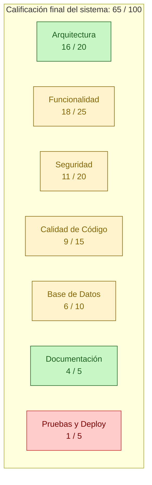
```mermaid
graph TB
    subgraph Score["Calificación final del sistema: 65 / 100"]
        direction LR
        A[Arquitectura<br/>16 / 20]:::ok
        F[Funcionalidad<br/>18 / 25]:::warn
        S[Seguridad<br/>11 / 20]:::warn
        C[Calidad de Código<br/>9 / 15]:::warn
        B[Base de Datos<br/>6 / 10]:::warn
        D[Documentación<br/>4 / 5]:::ok
        T[Pruebas y Deploy<br/>1 / 5]:::bad
    end

    classDef ok fill:#c8f7c5,stroke:#1b5e20,color:#1b5e20
    classDef warn fill:#fff3cd,stroke:#856404,color:#856404
    classDef bad fill:#ffcccc,stroke:#c62828,color:#7f0000
```

---

## 20. Distribución de Módulos (Pie)

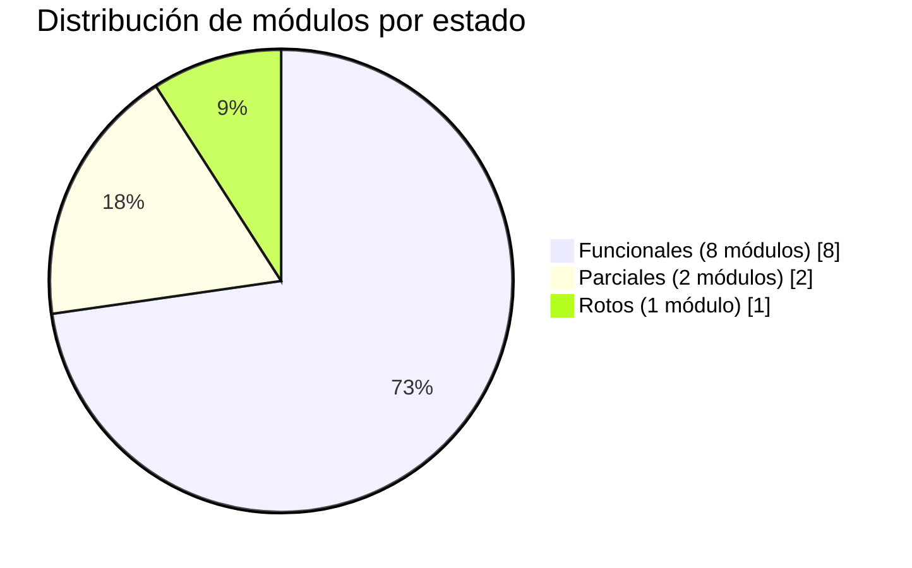
```mermaid
pie showData title Distribución de módulos por estado
    "Funcionales (8 módulos)" : 8
    "Parciales (2 módulos)" : 2
    "Rotos (1 módulo)" : 1
```

---

## 21. Distribución de Rutas (Pie)

```mermaid
pie showData title Distribución de las 54 rutas HTTP
    "Operativas" : 40
    "Placeholder" : 1
    "Rotas (HTTP 500)" : 13
```

---

## 22. Plan de Remediación (Gantt)

```mermaid
gantt
    title Roadmap de remediación BioVital
    dateFormat  YYYY-MM-DD
    axisFormat  %d-%b

    section 🔴 Crítico (Semana 1)
    Crear RecetaController.php          :crit, r1, 2026-05-22, 3d
    Crear AsistenteController.php       :crit, r2, 2026-05-22, 2d
    Quitar get_hash.php                 :crit, r3, 2026-05-22, 1d
    Mover credenciales BD a .env        :crit, r4, 2026-05-23, 2d
    display_errors=0 en producción      :crit, r5, 2026-05-24, 1d

    section 🟠 Alto (Semanas 2-3)
    Unificar CSRF (eliminar duplicado)  :a1, after r5, 3d
    session_regenerate_id en login      :a2, after a1, 1d
    Implementar listarUsuarios real     :a3, after a2, 3d
    Cookies httpOnly + secure           :a4, after a3, 1d
    Mensajes de error genéricos         :a5, after a4, 1d

    section 🟡 Medio (Semanas 4-6)
    Tabla usuarios + credenciales       :m1, after a5, 7d
    Renombrar tipo_paciente             :m2, after m1, 2d
    Campos created_at / updated_at      :m3, after m2, 3d
    Quitar 'echo' de modelos            :m4, after m3, 4d

    section 🟢 Bajo (Semana 7+)
    Composer + PSR-4 autoload   :b1, after m4, 3d
    .htaccess + URLs limpias    :b2, after b1, 2d
    Tests unitarios mínimos     :b3, after b2, 7d
    Dockerfile + docker-compose :b4, after b3, 3d
    CI/CD básico GitHub Actions :b5, after b4, 3d
```

---

## 23. Roadmap por Sprints

```mermaid
flowchart LR
    A[Estado actual<br/>65/100]:::now
    A --> B[Sprint 1<br/>Crítico cerrado<br/>+10 → 75/100]:::s1
    B --> C[Sprint 2<br/>Seguridad reforzada<br/>+8 → 83/100]:::s2
    C --> D[Sprint 3<br/>BD limpia + sin echo<br/>+5 → 88/100]:::s3
    D --> E[Sprint 4<br/>Tests + Deploy<br/>+5 → 93/100]:::ok

    classDef now fill:#fff3cd,stroke:#856404,color:#856404
    classDef s1 fill:#ffe0b2,stroke:#ef6c00,color:#ef6c00
    classDef s2 fill:#dcedc8,stroke:#558b2f,color:#558b2f
    classDef s3 fill:#c8e6c9,stroke:#2e7d32,color:#2e7d32
    classDef ok fill:#a5d6a7,stroke:#1b5e20,color:#1b5e20
```

---

## 24. Estructura de Carpetas

```mermaid
graph TD
    ROOT[biovital_otravez/]
    ROOT --> IDX[index.php<br/>front controller]
    ROOT --> HASH[get_hash.php ⚠️]:::warn
    ROOT --> API[api/]
    ROOT --> CFG[config/]
    ROOT --> CTRL[controlador/]
    ROOT --> MOD[modelo/]
    ROOT --> VW[vista/]
    ROOT --> CSS[css/]
    ROOT --> JS[js/]
    ROOT --> IMG[img/]
    ROOT --> DOC[docs/]

    API --> APICSRF[get_csrf_token.php ⚠️]:::warn
    CFG --> CAPP[app.php]
    CFG --> CROUTES[routes.php]

    CTRL --> CT1[AuthController.php]
    CTRL --> CT2[RegistroController.php]
    CTRL --> CT3[PerfilController.php]
    CTRL --> CT4[PanelController.php]
    CTRL --> CT5[PageController.php]
    CTRL --> CT6[PacienteController.php]
    CTRL --> CT7[MedicoController.php]
    CTRL --> CT8[AdministradorController.php]
    CTRL --> CT9[ConsultorioController.php]
    CTRL --> CT10[UbicacionController.php]
    CTRL --> CT11[CSRFController.php]
    CTRL --> CT12[LoginController.php]
    CTRL --> CTOLD[antiguos/<br/>RecetaController.php ❌<br/>AsistenteController.php ❌]:::bad

    MOD --> MD1[Conexion.php]
    MOD --> MD2[Security.php]
    MOD --> MD3[Paciente / LoginPaciente]
    MOD --> MD4[Medico / LoginMedico]
    MOD --> MD5[Asistente / LoginAsistente]
    MOD --> MD6[Administrador / LoginAdministrador]
    MOD --> MD7[Consultorio.php]
    MOD --> MD8[Receta.php ✅]:::ok

    VW --> VWPUB[home / login_*.php / registro_*.php]
    VW --> VWLAY[layouts/]
    VW --> VWE[errors/]
    VW --> VWPAC[paciente/]
    VW --> VWMED[medico/]
    VW --> VWASI[asistente/]
    VW --> VWADM[administrador/]

    DOC --> DDIA[diagramas/<br/>01-08 .md]

    classDef ok fill:#d4f8d4,stroke:#2e7d32,color:#1b5e20
    classDef warn fill:#fff3cd,stroke:#856404,color:#856404
    classDef bad fill:#ffcccc,stroke:#c62828,color:#7f0000
```

---

## 25. Mapa Mental del Sistema

```mermaid
mindmap
  root((BioVital))
    Frontend
      jQuery
      Bootstrap 4
      AdminLTE 3
      CSRF JS x2 ⚠️
    Backend PHP
      index.php Front Controller
      routes.php 54 rutas
      Controladores 13
      Modelos 12
      Vistas ~30
    Roles
      Paciente
      Médico
      Asistente
      Administrador
    Módulos
      Autenticación ✅
      Registro ✅
      Perfil ✅
      Paciente ✅
      Médico ✅
      Asistente ⚠️
      Administrador ✅
      Consultorios ✅
      Recetas ❌
      Ubicaciones ✅
      Seguridad CSRF ⚠️
    Base de Datos
      MySQL biovital
      Geografía 4 niveles
      4 tablas registro_*
      4 tablas login_*
      Consultorios
      Recetas
    Deuda técnica
      Falta RecetaController
      Falta AsistenteController
      get_hash.php expuesto
      Credenciales hardcoded
      display_errors en prod
      Doble CSRF
      Sin session_regenerate_id
      Sin auditoría BD
      Sin tests
      Sin Docker
```

---

## 26. Dependencias Controlador → Modelo → Tabla

Trazabilidad completa entre cada controlador, los modelos que invoca y las tablas que toca.

```mermaid
flowchart LR
    AC[AuthController]:::ok --> LP[LoginPaciente]:::ok
    AC --> LM[LoginMedico]:::ok
    AC --> LA[LoginAsistente]:::ok
    AC --> LD[LoginAdministrador]:::ok

    RC[RegistroController]:::ok --> MP[Paciente]:::ok
    RC --> MM[Medico]:::ok
    RC --> MA[Asistente]:::ok
    RC --> MAD[Administrador]:::ok

    PC[PerfilController]:::ok --> MP
    PC --> MM
    PC --> MA
    PC --> MAD

    PaC[PacienteController]:::ok --> MP
    MeC[MedicoController]:::ok --> MM
    AdC[AdministradorController]:::ok --> MAD
    CoC[ConsultorioController]:::ok --> MC[Consultorio]:::ok
    UC[UbicacionController]:::ok --> CX[Conexion]:::ok
    CSC[CSRFController]:::ok --> SEC[Security]:::ok

    ReC[RecetaController ❌]:::bad -.-> MR[Receta]:::ok
    AsC[AsistenteController ❌]:::bad -.-> MA

    LP --> TLP[(login_paciente)]
    LM --> TLM[(login_medico)]
    LA --> TLA[(login_asistente)]
    LD --> TLD[(login_administrador)]
    MP --> TRP[(registro_paciente)]
    MM --> TRM[(registro_medico)]
    MA --> TRA[(registro_asistente)]
    MAD --> TRAD[(registro_administrador)]
    MC --> TC[(consultorios)]
    MC --> TCM[(consultorio_medicos)]
    MC --> TH[(horarios)]
    MR --> TR[(recetas)]
    CX --> TG1[(estados)]
    CX --> TG2[(ciudades)]
    CX --> TG3[(municipios)]
    CX --> TG4[(parroquias)]
    CX --> TG5[(especialidades)]
    CX --> TTP[(tipo_paciente)]

    classDef ok fill:#d4f8d4,stroke:#2e7d32,color:#1b5e20
    classDef bad fill:#ffcccc,stroke:#c62828,color:#7f0000
```

---

## 📎 Anexo — Convenciones

| Símbolo | Significado |
|---------|-------------|
| ✅ | Operativo |
| ⚠️ | Parcial / advertencia |
| ❌ | Roto / falta archivo |
| `:::ok` | Estilo verde (Mermaid) |
| `:::warn` | Estilo amarillo (Mermaid) |
| `:::bad` | Estilo rojo (Mermaid) |
| → | Dependencia síncrona (PHP `require` / HTTP) |
| -.-> | Comunicación asíncrona (AJAX) o dependencia rota |

> 💡 Para visualizar los diagramas: GitHub renderiza Mermaid automáticamente, o use cualquier visor como [mermaid.live](https://mermaid.live).
