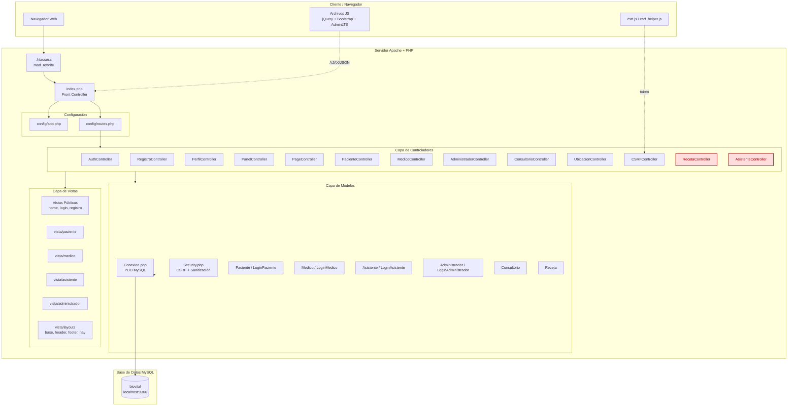

# Diagrama 1 — Arquitectura General del Sistema BioVital

Vista de alto nivel del sistema: capas, componentes principales y dependencias.

## Leyenda

- **Bloques rojos (`:::missing`)**: controladores referenciados en `config/routes.php` pero **inexistentes** en `/controlador/`. Sólo existen versiones obsoletas en `/controlador/antiguos/`. Cualquier ruta que los invoque devuelve error 500.
- **Flechas continuas**: dependencia síncrona (request HTTP / include PHP).
- **Flechas punteadas**: comunicación asíncrona (AJAX desde el navegador).

## Capas

| Capa | Responsabilidad | Tecnología |
|------|----------------|------------|
| Cliente | Render, validación frontend, AJAX | HTML5 + jQuery + Bootstrap 4 + AdminLTE 3 |
| Front Controller | Enrutamiento, autoload, sesión, CSRF | PHP 7+, Apache mod_rewrite |
| Controladores | Lógica de negocio, orquestación | PHP OOP |
| Modelos | Acceso a datos, reglas de dominio | PDO + MySQL |
| Vistas | Presentación | PHP embebido (templating manual) |
| Base de Datos | Persistencia | MySQL 5.7+ / MariaDB |
