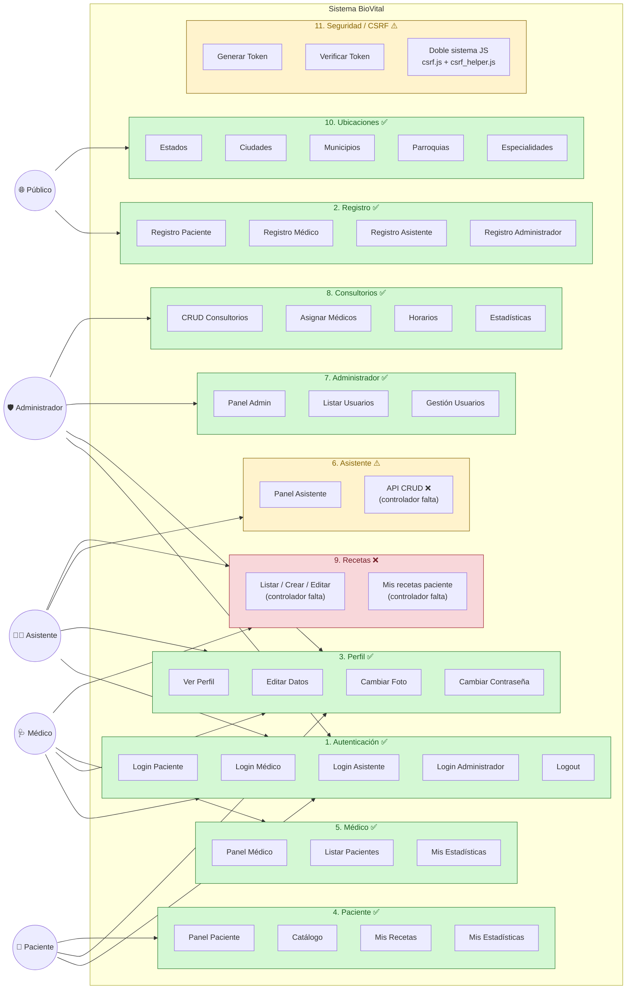

# Diagrama 2 — Mapa de Módulos Funcionales

Distribución de los módulos del sistema, su estado y los roles que los consumen.

## Resumen de Módulos

| # | Módulo | Estado | Notas |
|---|--------|--------|-------|
| 1 | Autenticación | ✅ Funcional | 4 logins por rol + logout. Usa bcrypt. |
| 2 | Registro | ✅ Funcional | 4 registros por rol con validación CSRF. |
| 3 | Perfil | ✅ Funcional | Edición transversal a todos los roles. |
| 4 | Paciente | ✅ Funcional | Panel, catálogo y consulta de recetas. |
| 5 | Médico | ✅ Funcional | Panel, listado de pacientes, estadísticas. |
| 6 | Asistente | ⚠️ Parcial | Login y panel sí, pero **falta `AsistenteController.php`** activo → 5 endpoints rotos. |
| 7 | Administrador | ✅ Funcional | Gestión de usuarios y consultorios. |
| 8 | Consultorios | ✅ Funcional | CRUD completo, asignación de médicos, horarios. |
| 9 | Recetas | ❌ Roto | **Falta `RecetaController.php`** activo → 8 endpoints rotos. |
| 10 | Ubicaciones | ✅ Funcional | APIs jerárquicas (estado → ciudad → municipio → parroquia). |
| 11 | Seguridad / CSRF | ⚠️ Doble sistema | Conviven dos implementaciones JS y dos endpoints. |

### Total

- **11 módulos identificados**
- **8 módulos 100 % funcionales** (≈ 73 %)
- **2 módulos parcialmente funcionales** (Asistente, CSRF)
- **1 módulo roto** (Recetas)
