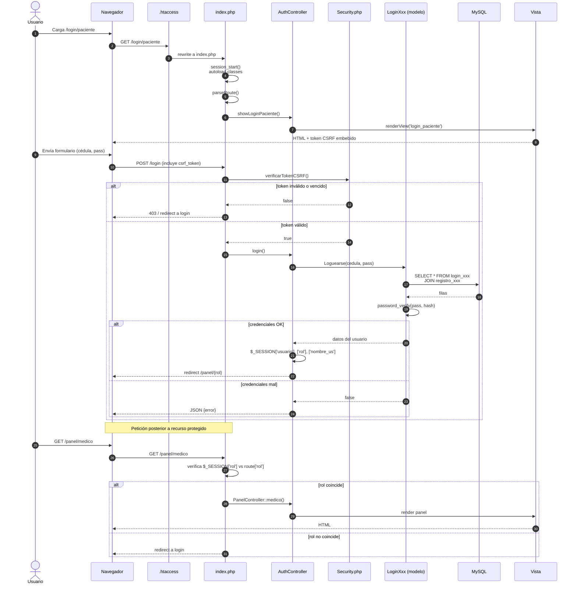

# Diagrama 4 — Flujo de Autenticación y Autorización

Cómo viaja una sesión desde el formulario de login hasta el panel autorizado.

## Estado de la implementación

| Aspecto | Estado | Detalle |
|---------|--------|---------|
| Hashing de contraseña | ✅ Correcto | `password_hash` con `PASSWORD_DEFAULT` (bcrypt) y `password_verify`. |
| CSRF token | ⚠️ Doble sistema | `csrf.js` (POST a `/api/csrf/token`) y `csrf_helper.js` (GET a `/api/get_csrf_token.php`) conviven. |
| Expiración de sesión | ❌ No implementada | No hay `session.cookie_lifetime` ni `regenerate_id()` después del login. |
| Brute-force protection | ❌ No implementada | No hay rate-limit ni bloqueo tras N intentos. |
| `httpOnly` / `secure` cookies | ❌ No configurado | Cookies de sesión usan defaults de PHP. |
| Regeneración de session ID | ❌ Falta | Tras login debería llamarse `session_regenerate_id(true)` para evitar fixation. |
| Logout | ✅ Implementado | `AuthController::logout` destruye sesión. |
| Mensajes de error genéricos | ⚠️ Parcial | Algunos endpoints exponen "usuario no existe" vs "contraseña incorrecta" (enumeration). |
