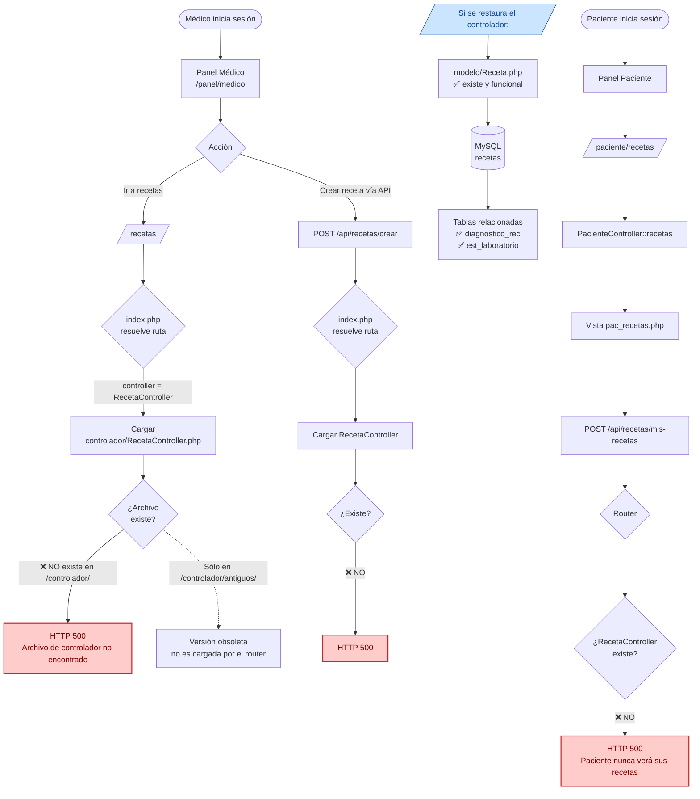

# Diagrama 5 — Flujo del Módulo de Recetas (estado actual: ROTO)

Recorrido completo de una receta desde la creación por el médico hasta la consulta por el paciente, **señalando dónde se rompe** hoy el flujo.

## Endpoints afectados por la falta de `RecetaController.php`

| Ruta | Método | Rol | Estado |
|------|--------|-----|--------|
| `/recetas` | GET | médico, asistente | ❌ 500 |
| `/api/recetas/listar` | POST | médico, asistente | ❌ 500 |
| `/api/recetas/crear` | POST | médico | ❌ 500 |
| `/api/recetas/editar` | POST | médico | ❌ 500 |
| `/api/recetas/borrar` | POST | médico | ❌ 500 |
| `/api/recetas/obtener` | POST | autenticado | ❌ 500 |
| `/api/recetas/buscar-pacientes` | POST | médico, asistente | ❌ 500 |
| `/api/recetas/mis-recetas` | POST | paciente | ❌ 500 |

> 💡 El modelo `Receta.php` **sí existe y está completo**: tiene CRUD, búsqueda de pacientes, guardado de diagnóstico y estudios de laboratorio. Sólo falta el controlador que lo orqueste con las rutas.
