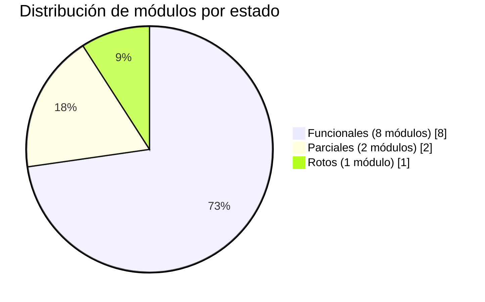
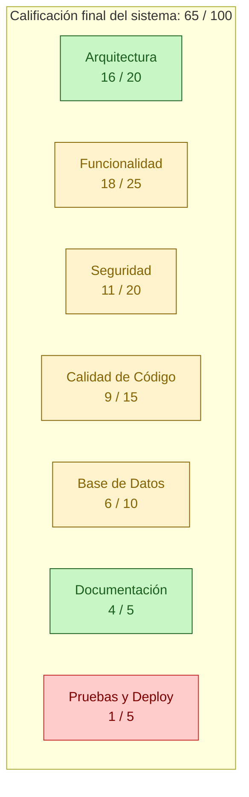

# Diagrama 6 — Estado de Implementación por Capa

Visión gráfica de qué porcentaje de cada capa está realmente operativo en este momento.

## Tabla de calificación detallada

| Categoría | Peso | Obtenido | Comentario |
|-----------|------|----------|-----------|
| Arquitectura | 20 | **16** | MVC claro, front-controller, autoloader, rutas centralizadas. Falta `.htaccess` para URLs limpias y no hay `composer.json`. |
| Funcionalidad | 25 | **18** | 8 / 11 módulos operativos. Recetas (crítico) y Asistente (parcial) no responden a sus rutas. |
| Seguridad | 20 | **11** | Bien: bcrypt, CSRF, prepared statements. Mal: `display_errors=1` en producción, `get_hash.php` expuesto, doble sistema CSRF, sin `session_regenerate_id`, sin rate limit, mensajes con enumeration. |
| Calidad de código | 15 | **9** | Duplicación de 4 clases `Login*` casi idénticas, `echo` desde modelos (anti-patrón), vistas con PHP/HTML/JS mezclados, controladores con verificación de rol repetida. |
| Base de datos | 10 | **6** | Bien normalizada en geografía, mal normalizada en usuarios (4 tablas `registro_*` y 4 `login_*`). Sin auditoría (`created_at`, `updated_at`, `created_by`). |
| Documentación | 5 | **4** | Existe `docs/diagramas` con 4 documentos vivos; falta README de instalación, runbook y diccionario de datos. |
| Pruebas y deploy | 5 | **1** | No hay tests, no hay CI/CD, no hay Dockerfile, credenciales hardcodeadas (`root` sin contraseña). |
| **Total** | **100** | **65** | Sistema funcional para demo, **no listo para producción clínica**. |

## Lectura rápida del puntaje

- **0–40**: prototipo, no usar más allá de pruebas.
- **41–60**: MVP que necesita endurecimiento serio.
- **61–75**: **← aquí está BioVital**. Sistema usable para piloto controlado tras cerrar las brechas críticas.
- **76–90**: producción para entornos no críticos.
- **91–100**: producción clínica con cumplimiento normativo.
