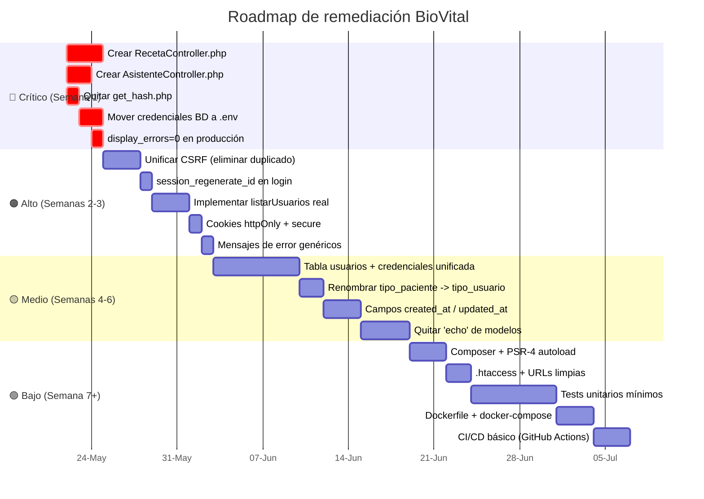
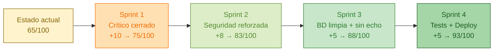

# Diagrama 7 — Plan de Remediación (Roadmap)

Camino sugerido para llevar el sistema de **65 / 100** a **90 / 100** sin reescribirlo.

## Definición de "listo" por sprint

### Sprint 1 — Crítico (objetivo: que **todas** las rutas devuelvan 200/3xx, no 500)
- [ ] Restaurar `RecetaController.php` (puede partirse de `/controlador/antiguos/RecetaController.php` y adaptarlo al nuevo front-controller).
- [ ] Restaurar `AsistenteController.php` (mismo patrón que `PacienteController`).
- [ ] Eliminar `get_hash.php` del repositorio.
- [ ] Crear `config/db.php` con lectura de variables de entorno.
- [ ] `error_reporting` y `display_errors` controlados por `APP_ENV`.

### Sprint 2 — Seguridad
- [ ] Borrar `js/csrf_helper.js` y `api/get_csrf_token.php`; dejar sólo `CSRFController`.
- [ ] En `AuthController::login` añadir `session_regenerate_id(true)` tras autenticar.
- [ ] `session_set_cookie_params(['httponly'=>true,'samesite'=>'Strict','secure'=>true])`.
- [ ] Implementar `AdministradorController::listarUsuarios` real con paginación.
- [ ] Unificar mensaje de credenciales inválidas.

### Sprint 3 — Limpieza de BD y modelos
- [ ] Migración a tabla única `usuarios` con FK a `roles`; mantener vistas SQL para no romper el front.
- [ ] Renombrar `tipo_paciente` → `tipo_usuario`.
- [ ] Añadir `created_at`, `updated_at`, `created_by`, `actor_id` a tablas operativas.
- [ ] Reemplazar `echo 'add'` / `echo 'existe'` por retornos `bool`/excepciones.

### Sprint 4 — Calidad y despliegue
- [ ] `composer.json` + PSR-4 + autoload real.
- [ ] `.htaccess` con `RewriteEngine` para URLs limpias.
- [ ] PHPUnit con al menos: login OK / login KO / CSRF inválido / CRUD receta.
- [ ] Dockerfile + docker-compose (PHP-FPM + MySQL + Nginx).
- [ ] Pipeline en GitHub Actions: lint + tests + build de imagen.
