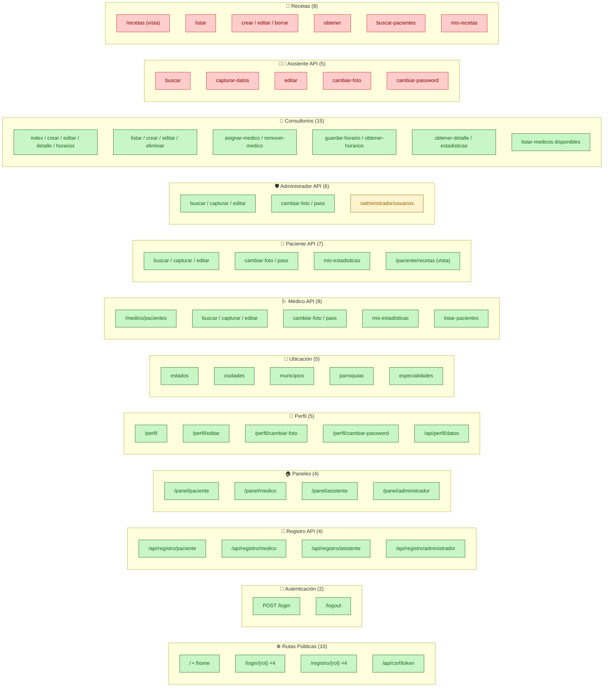

# Diagrama 8 — Mapa Completo de Rutas y Su Estado

Las **53 rutas** definidas en `config/routes.php`, clasificadas por estado y controlador.

## Conteo

| Estado | Rutas | % |
|--------|-------|---|
| ✅ Operativas (verde) | 40 | **75 %** |
| ⚠️ Placeholder / parcial | 1 | 2 % |
| ❌ Devuelven HTTP 500 | 13 | **23 %** |
| **Total** | **54** | 100 % |

> El módulo de recetas y el de asistente concentran el 100 % de las rutas rotas. Cerrar esos dos controladores eleva la operatividad al **98 %** de inmediato.
